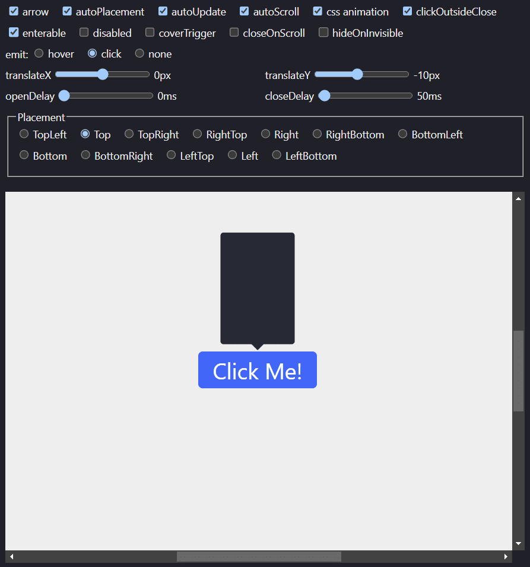

# [PopFlow](https://popflow.github.io/popflow/)

[](https://github.com/popflow/popflow) 
[](https://github.com/popflow/popflow) 

PopFlow 是一个体积小，功能轻大的弹出工具库，它可以自动定位到 Trigger 附近合适的位置。同时它还支持虚拟元素，可以在 canvas 元素中使用，和 CSS 类动画。

[在线体验](https://popflow.github.io/popflow/)

[](https://popflow.github.io/popflow/)

[English](./README_zh.md)

## 安装

```
npm i popflow
```

或者通过 CDN 使用

```html
<script src="https://unpkg.com/popflow@latest/dist/index.min.js"></script>
<script>
  console.log(popflow)
</script>
```

## 快速开始

```js
import { Popflow } from 'popflow'

const container = document.querySelector('.container'); // 默认: document.body
const trigger = document.querySelector('.trigger'); 
// 或者虚拟元素. 类型: { getBoundingClientRect: () =>  { left: number, top: number, width: number, height: number } }

const content = document.createElement('div'); // 你需要弹出显示的内容
content.classList.add('content');

const popflow = new Popflow({
  container,
  trigger, // 必填
  content, // 必填
})

trigger.onclick = () => {
  popflow.toggle()
  // 或者
  // if (popflow.opening) {
  //   popflow.close();
  // } else {
  //   popflow.open();
  // }
}

// 如果你不需要 popflow
popflow.destroy()
```

### CSS 动画

通过 `cssName` 参数可以在弹出层显示和隐藏时，添加 CSS 动画。

```js
const popflow = new PopFlow({
  cssName: 'fade'
})
```

PopFlow 会通过 `cssName` 添加下面 6 个类。

```js
`${cssName}-enter-from` // 开始显示，下一帧被移除
`${cssName}-enter-active` // 下一帧被添加，动画结束时移除
`${cssName}-enter-to` // 下一帧被添加，动画结束时移除
`${cssName}-exit-from` // 开始隐藏，下一帧被移除
`${cssName}-exit-active` // 下一帧被添加，动画结束时移除
`${cssName}-exit-to` // 下一帧被添加，动画结束时移除
```

你可以编写如下 css 样式。

```css
.fade-enter-from, .fade-exit-to {
  transform: scale(.7);
  opacity: 0;
}
.fade-enter-active, .fade-exit-active {
  transition: transform .1s ease, opacity .1s ease;
}
```

### 箭头

通过 `arrow` 参数可以添加自定义箭头元素。

```js
const arrow = document.createElement('div')
arrow.classList.add('arrow')

const popflow = new PopFlow({
  arrow
})
```

```css
.arrow {
  width: 12px;
  height: 12px;
  transform: rotate(45deg);
  transform-origin: center;
  background: #000;
}
```

### 滚动

通过 `autoScroll` 参数可以控制 `trigger` 元素滚动时，弹出层自动跟随滚动。

`closeOnScroll` 参数控制 `trigger` 元素滚动时，弹出层自动关闭。

`hideOnInvisible` 参数控制 `trigger` 元素在屏幕上看不见时，弹出层自动隐藏。

### 自动更新

`autoUpdate` 参数控制当容器，内容，trigger 大小发生改变时，自动更新弹出层位置。依赖 [ResizeObserver](https://developer.mozilla.org/en-US/docs/Web/API/ResizeObserver) 。

`autoPlacement` 参数控制当空间的不足时是否自动调整位置，让弹出层完全展出出来。

### 钩子

PopFlow 提供了丰富的钩子函数，可以在弹出层的各个生命周期执行代码。

```js
new PopFlow({
  onBeforeEnter() {
    // css 展示动画开始前
  },
  onEntered() {
    // css 展示动画完成后
  },
  onBeforeExit() {
    // css 关闭动画开始前
  },
  onExited() {
    // css 关闭动画完成后
  },
  onBeforePosition(pos) {
    // 设置弹出层位置前
    // pos.position 最终的展示位置
    // pos.xy 弹出层的位置，undefined 时表示不展示
    // pos.arrowXY arrow 的位置，undefined 时表示不展示
    // 你可以直接修改 xy 和 arrowXY 来改变最终的位置
    if (pos.xy) pos.xy[0] += 10
    if (pos.arrowXY) pos.arrowXY[0] += 10
  },
  onOpen() {
    // 弹出层展示时
  },
  onClose() {
    // 弹出层关闭时
  }
})
```

### 虚拟元素

`trigger` 参数除了是 DOM 元素之外，还可以是一个虚拟元素。这样你就可以在 canvas 中使用。当 canvas 中发生滚动时，你可以手动调用 `popflow.onScroll()` 方法来触发弹出层滚动。

```js
const popflow = new PopFlow({
  trigger: {
    getBoundingClientRect() {
      return {
        left: 0,
        top: 0,
        width: 0,
        height: 0
      }
    }
  }
})

canvas.on('scroll', () => popflow.onScroll())
```

## API

### 配置

| 参数 | 类型 | 描述 |
| -- | -- | -- |
| `container` | `HTMLElement` | 弹出层的容器，默认值： `document.body` |
| `content` | `Element` | 要弹出的内容元素 |
| `trigger` | `{ getBoundingClientRect: () => Rect } \| Element` | 触发元素 |
| `arrow` | `Element` | 箭头元素 |
| `placement` | `PLACEMENT` | 弹出层的位置。默认：`'t'` |
| `translate` | `[number, number]` | 自定义 xy 偏移量 |
| `autoPlacement` | `boolean` | 自动切换位置，当空间不足。默认：`true` |
| `autoUpdate` | `boolean` | 容器，内容，触发元素大小变化自动更新位置。默认：`true` |
| `autoScroll` | `boolean` | 自动跟随滚动。默认：`true` |
| `cssName` | `string` | css 动画类名 |
| `overflowHidden` | `boolean` | 容器是否 overflow hidden，默认自动检测 |
| `coverTrigger` | `boolean` | 弹出层是否覆盖 trigger 元素 |
| `closeOnScroll` | `boolean` | 是否在滚动时自动关闭 |
| `hideOnInvisible` | `boolean` | 让 trigger 元素在屏幕上不可以见时自动隐藏弹出层 |
| `onBeforeEnter` | `() => void` | css 进入动画开始之前 |
| `onEntered` | `() => void` | css 进入动画完成时 |
| `onBeforeExit` | `() => void` | css 关闭动画开始之前 |
| `onExited` | `() => void` | css 关闭动画完成 |
| `onBeforePosition` | `(pos: Position) => void` | 在设置弹出层位置之前，你可以修改 pos 对象，来设置最终弹出层位置 |
| `onOpen` | `() => void` | 当弹出层展示 |
| `onClose` | `() => void` | 当弹出层关闭 |

### 属性

| 参数 | 类型 | 描述 |
| -- | -- | -- |
| `el` | `HTMLElement` | 弹出层元素 |
| `config` | `PopFlowConfig` | PopFlow 配置参数 |
| `opening` | `boolean` | 当前弹出层是否显示 |
| `isAnimation` | `boolean` | 当前是否在进行 css 动画 |

### 方法

#### open()

开启弹出层

```ts
open(): void;
```

#### close()

关闭弹出层

```ts
close(): void;
```

#### toggle()

如果弹出层是关闭的则打开，否则关闭

```ts
toggle(): void;
```

#### destroy()

销毁 popflow 实例

```ts
destroy(): void;
```

#### onScroll()

手动触发 onScroll 事件，一般只在虚拟元素中使用。

```ts
onScroll(): void;
```

#### update()

手动更新弹出层位置。

```ts
update(): void;
```
